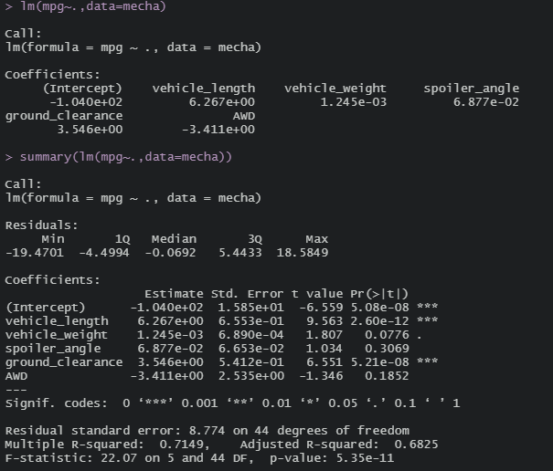

# MechaCar Statistical Analysis

## Challenge Overview
You are to:
- perform multiple linear regression analysis to identify which variables in the dataset predict the mpg of MechaCar prototypes
- collect summary statistics on the pounds per square inch (PSI) of the suspension coils from the manufacturing lots
- run t-tests to determine if the manufacturing lots are statistically different from the mean population
- design a statistical study to compare vehicle performance of the MechaCar vehicles against vehicles from other manufacturers. For each statistical analysis, you’ll write a summary interpretation of the findings.

## Resources
- MechaCar_mpg.csv, Suspension_coil.csv, mpg dataset in ggplot2
- Software: R 4.0.3, Visual Studio Code 1.47.2

## Linear Regression to Predict MPG

Looking at the summary of the linear regression, we can see that vehicle length and ground clearance have a significant impact on predicting mpg. This is because their respective Pr(>|t|) values are less than .05.

The slope of the linear model is considered to be not 0 because our p-value is less than our assumed significance level of .05.

This linear model is moderately effective at predicting mpg of MechaCar prototypes as indicated by the R-squared value of .7149, or 71.49%.

## Summary Statistics on Suspension Coils
Total Lots Summary | Individual Lot Summary
:-----------------:|:---------------------:
 | 

The design specifications for the MechaCar suspension coils dictate that the variance of the suspension coils must not exceed 100 pounds per square inch. Looking at the total lot summary, the data does meet the design specifications. However, looking at each individual lot summary, we can see that Lot 3 does not meet the variance of the suspension coils.